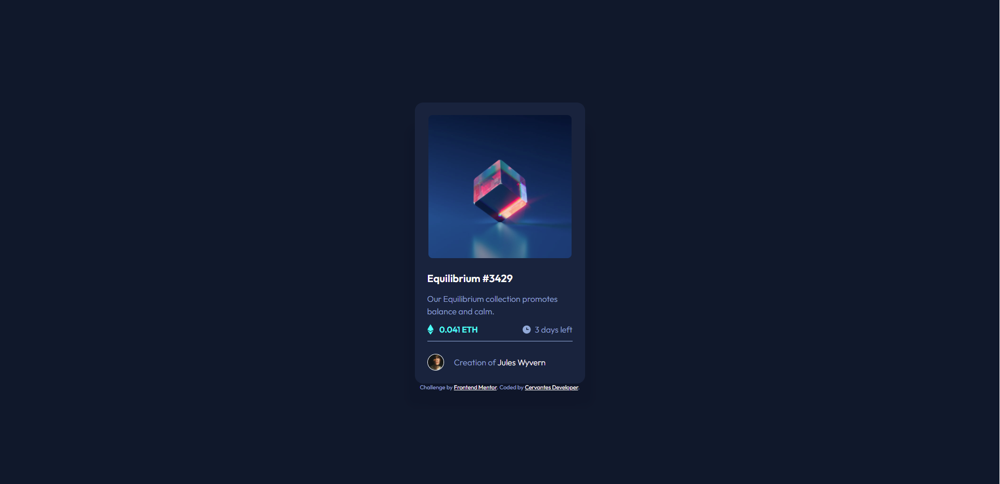

# Frontend Mentor - NFT preview card component solution

This is a solution to the [NFT preview card component challenge on Frontend Mentor](https://www.frontendmentor.io/challenges/nft-preview-card-component-SbdUL_w0U). Frontend Mentor challenges help you improve your coding skills by building realistic projects. 

## Table of contents

- [Overview](#overview)
  - [The challenge](#the-challenge)
  - [Links](#links)
- [My process](#my-process)
  - [Built with](#built-with)
  - [What I learned](#what-i-learned)
  - [Continued development](#continued-development)
  - [Useful resources](#useful-resources)
- [Author](#author)
- [Acknowledgments](#acknowledgments)

## Overview

### The challenge

Users should be able to:

- View the optimal layout depending on their device's screen size
- See hover states for interactive elements

### Screenshot

### Links

- Live Site URL: [my solution](https://cervantesdeveloper.github.io/NTF-preview-card-component/)

## My process

### Built with

- BEM methodology
- Flexbox
- Mobile-first workflow

### What I learned

I learned about Git and github (I'm still learning), also I was struggling with the layout due to I didn't know where put some elements.

### Continued development

I'll be solving some projects as newfie and jr while I take some lessons about JS and CSS Grid.

### Useful resources

- [BEM methodology](https://en.bem.info/) - This helped me remember the BEM methodology.

## Author

- Website - [Cervantes Developer](https://cervantesdeveloper.github.io/NTF-preview-card-component/)
- Frontend Mentor - [@cervantesdeveloper](https://www.frontendmentor.io/profile/cervantesdeveloper)

